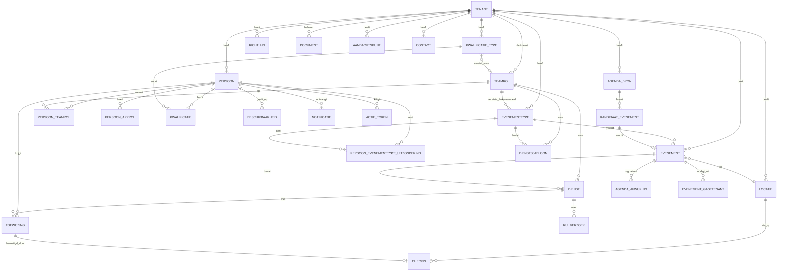

# Datamodel

Postgres, één schema, `tenant_id` op elke tabel, row-level security als
vangnet. De policies zelf staan in `db/001_tenancy_rls.sql`.

## ERD

## Tabellen

### Tenant en identiteit

**tenant** — `id`, `naam`, `slug` (subdomein), `actief`, `aangemaakt_op`

**persoon** — `id`, `tenant_id` (thuis-tenant), `voornaam`, `tussenvoegsel`,
`achternaam`, `geboortedatum`, `email`, `telefoon`, `chat_id` (nullable),
`status` (actief | inactief), `gestopt_op`, `gepseudonimiseerd_op`

**persoon_approl** — `persoon_id`, `approl` (platformbeheerder |
tenantbeheerder | planner | deelnemer)

**teamrol** — `id`, `tenant_id`, `naam`, `soort` (dienstrol | bekwaamheid),
`hesje_kleur` (nullable), `actief`

> Eén tabel, twee soorten. **dienstrol** = waarvoor je diensten inricht:
> hoofd-BHV, BHV, toezicht, EHBO. **bekwaamheid** = losse vaardigheden
> zonder eigen dienst: reanimatie, sleutelbeheer, techniek. Configureerbaar
> per tenant, geen enum — er zijn er in de praktijk minstens elf, waaronder
> zaalwacht, ontruimingscoördinator en parkeerwacht.

**persoon_teamrol** — `persoon_id`, `teamrol_id`, `bevestigd_op`,
`bevestigd_door_persoon_zelf`

> De bevestigingskolommen zijn essentieel. De werkwijze is dat de
> coördinator een indeling voorstelt en iedereen die controleert op zijn
> eigen beleving. De applicatie ondersteunt die ronde, hij vervangt hem niet.

**actie_token** — `id`, `persoon_id`, `doel` (login | dienst_actie |
chat_koppeling), `token_hash`, `scope_id` (bv. `dienst_id`), `geldig_tot`,
`gebruikt_op`

> Tokens altijd gehasht opslaan. Eenmalig gebruik voor login, kort geldig
> voor dienstacties, en altijd beperkt tot één dienst.

### Kwalificaties en beschikbaarheid

**kwalificatie_type** — `id`, `tenant_id`, `naam`, `vereist_voor_teamrol_id`
(nullable), `standaard_geldigheid_maanden`

**kwalificatie** — `id`, `persoon_id`, `kwalificatie_type_id`, `behaald_op`,
`geldig_tot`, `notitie`

**beschikbaarheid** — `id`, `persoon_id`, `van`, `tot`, `soort`
(niet_beschikbaar | voorkeur), `notitie`

> Zonder dit is de sortering fictie: je plant iemand in die op vakantie is
> en dat blijkt pas op de dag zelf.

### Evenementen

**evenementtype** — `id`, `tenant_id`, `naam`, `doelgroep_omschrijving`,
`doelgroep_leeftijd_van` (nullable), `doelgroep_leeftijd_tot` (nullable),
`inzetbaar_leeftijd_van` (nullable), `inzetbaar_leeftijd_tot` (nullable),
`vereiste_bekwaamheid_id` (nullable), `verwacht_aantal_bezoekers`
(nullable), `actief`

> **Doelgroep** = leeftijd van de bezoekers; beschrijvend, niet in de
> matching. **Inzetbaar** = leeftijd van veiligheidsmensen die voor dit type
> ingezet kunnen worden; leidend maar niet blokkerend, en overschrijfbaar
> per dienstsjabloon. **Vereiste bekwaamheid** is een optionele haak voor
> types waar een specifieke vaardigheid telt.
>
> **Types zijn fijnmazig: activiteit × leeftijdsgroep.** IJshockey voor
> kinderen is een ander type dan voor jeugd. Reken op flink meer types dan
> je vooraf denkt, en houd het aanmaken daarom licht — naam, twee bereiken,
> dienstsjabloon, klaar. Een "dupliceer dit type"-knop verdient zichzelf
> snel terug.

**persoon_evenementtype_uitzondering** — `persoon_id`, `evenementtype_id`,
`oordeel` (altijd_inzetten | niet_inzetten), `reden` (verplicht),
`vastgelegd_door`, `vastgelegd_op`

> Overrulet het leeftijdsbereik in beide richtingen. Hier legt de
> coördinator vast dat iemand bewust wel of niet bij een type wordt
> ingezet, mét reden — zodat dat besluit zijn vertrek overleeft in plaats
> van te verdwijnen als toevallige uitkomst van een bereik.

**dienstsjabloon** — `id`, `evenementtype_id`, `teamrol_id`, `aantal`,
`start_offset_minuten`, `duur_minuten`, `inzetbaar_leeftijd_van`
(nullable), `inzetbaar_leeftijd_tot` (nullable)

> Het leeftijdsbereik mag per teamrol afwijken: bij een jeugdevenement wil
> je jonge toezichthouders, maar de leeftijd van de EHBO'er doet er niet
> toe. **Leeg betekent: neem het bereik van het evenementtype over.**

**agenda_bron** — `id`, `tenant_id`, `ics_url`, `laatste_sync_op`,
`laatste_sync_status`, `actief`

**kandidaat_evenement** — `id`, `agenda_bron_id`, `ics_uid`,
`recurrence_id`, `titel`, `start`, `eind`, `locatie_tekst`, `inhoud_hash`,
`status` (nieuw | gekoppeld | genegeerd | gewijzigd | verwijderd_in_bron)

> Sleutel is `(agenda_bron_id, ics_uid, recurrence_id)`. De `inhoud_hash`
> maakt sync idempotent en detecteert wijzigingen.

**locatie** — `id`, `tenant_id`, `naam`, `adres`, `qr_slug`

**evenement** — `id`, `tenant_id` (eigenaar), `evenementtype_id`,
`kandidaat_evenement_id` (**nullable — handmatig aanmaken is een
hoofdpad**), `locatie_id`, `titel`, `start`, `eind`, `status` (concept |
gepland | geannuleerd), `bron` (agenda | handmatig)

> Bruiloften, sportwedstrijden en externe activiteiten staan wel in het
> rooster maar niet in de agendafeed. De locatie is dus ook niet altijd de
> eigen accommodatie.

**agenda_afwijking** — `id`, `evenement_id`, `soort` (bron_verwijderd |
tijd_gewijzigd | geen_bron_meer), `gedetecteerd_op`, `afgehandeld_op`

> Mismatch-detectie tussen rooster en agenda. Zonder dit ontdekt iemand pas
> bij het ruilen dat het evenement waarvoor hij ingedeeld staat niet meer
> bestaat.

**evenement_gasttenant** — `evenement_id`, `tenant_id`, `status`
(uitgenodigd | geaccepteerd | geweigerd)

### Rooster

**dienst** — `id`, `evenement_id`, `teamrol_id`, `start`, `eind`,
`benodigd_aantal`, `notitie`

**toewijzing** — `id`, `dienst_id`, `persoon_id`, `status` (ingedeeld |
afgemeld | ingecheckt | no_show), `toegewezen_door`, `toegewezen_op`,
`afgemeld_op`, `afmeld_reden` (nullable), `waarschuwingen_bij_toewijzing`
(jsonb)

> `waarschuwingen_bij_toewijzing` legt vast dat de planner bewust tegen een
> zacht signaal in heeft gepland. Puur informatief; er wordt niets
> geblokkeerd, dus er valt niets te overrulen.
>
> Let op `afmeld_reden`: "ziek" is een gezondheidsgegeven. Vrij invulbaar
> laten of weglaten, en kort bewaren.

**ruilverzoek** — `id`, `dienst_id`, `toewijzing_id` (nullable),
`aangevraagd_door_persoon_id`, `doel_persoon_id` (nullable), `soort` (ruil |
open_oproep), `status` (open | geaccepteerd | afgewezen | verlopen),
`verloopt_op`

> Twee patronen, één tabel. **Ruil**: A draagt over aan B, `doel_persoon_id`
> gevuld. **Open oproep**: een vraag aan de pool, `doel_persoon_id` leeg,
> wie het eerst claimt krijgt hem. De open oproep komt in de praktijk vaker
> voor dan de ruil en ontstaat ook automatisch bij een afmelding.
> Acceptatie werkt de toewijzing direct bij — anders liegt het dagoverzicht.

**checkin** — `id`, `toewijzing_id`, `methode` (qr | zelf | leidinggevende),
`door_persoon_id`, `tijdstip`

### Informatielaag

**richtlijn** — `id`, `tenant_id`, `titel`, `html_gesaniteerd`,
`zichtbaarheid` (algemeen | beperkt), `soort` (kaart | document),
`volgorde`, `versie`, `gepubliceerd_op`, `bijgewerkt_door`

> HTML wordt server-side gesaniteerd met een allow-list en gesaniteerd
> opgeslagen. Nooit `bypassSecurityTrustHtml` gebruiken om van een
> waarschuwing af te komen; dat is opgeslagen XSS.
>
> `zichtbaarheid = beperkt` betekent: alleen leidinggevenden en
> coördinatoren, verse login vereist, **niet** offline gecachet. Daar hoort
> alles in wat over de fysieke beveiliging van een locatie gaat.

**document** — `id`, `tenant_id`, `titel`, `versie_label`, `bestand_ref`,
`is_actueel`, `gepubliceerd_op`

> Eén canonieke versie van het handboek. Oudere versies blijven bestaan
> maar zijn niet `is_actueel`.

**aandachtspunt** — `id`, `tenant_id`, `titel`, `tekst`, `geldig_van`,
`geldig_tot` (**niet nullable**), `evenementtype_id` (nullable),
`prioriteit`

> De verplichte einddatum is het hele punt. Een aandachtspunt zonder
> vervaldatum wordt binnen twee maanden behang.

**contact** — `id`, `tenant_id`, `naam`, `functie`, `telefoon`,
`is_noodnummer`, `volgorde`

### Techniek

**notificatie** — `id`, `tenant_id`, `persoon_id`, `kanaal` (email | chat |
webpush), `sjabloon`, `context_id`, `gepland_op`, `verzonden_op`, `status`,
`idempotency_key` (uniek)

> De unieke `idempotency_key` voorkomt dubbele herinneringen na een
> herstart van de scheduler.

**auditlog** — `id`, `tenant_id`, `actor_persoon_id`, `entiteit`,
`entiteit_id`, `actie`, `oude_waarde` (jsonb), `nieuwe_waarde` (jsonb),
`tijdstip`

## Row-level security

De volledige set policies staat in `db/001_tenancy_rls.sql`. In het kort:

- Elke tenant-tabel heeft `ENABLE` **én** `FORCE ROW LEVEL SECURITY`.
  Zonder `FORCE` omzeilt de tabeleigenaar zijn eigen policies.
- `app.current_tenant()` leest `current_setting('app.tenant_id', true)` en
  geeft NULL als de waarde ontbreekt. Elke policy vergelijkt daarmee, dus
  een defect levert een lege lijst op in plaats van gegevens van een andere
  tenant.
- Afgeleide tabellen (`dienst`, `toewijzing`, `kwalificatie`) erven hun
  zichtbaarheid via een `EXISTS` op de bovenliggende tabel, die zelf al
  gefilterd wordt. Zo staat de gastlogica op één plek.
- De applicatie verbindt als `bcc_app`: geen `BYPASSRLS`, geen
  eigenaarschap. Migraties draaien als `bcc_owner`.

### Valkuil: connection pooling

`app.tenant_id` mag nooit blijven hangen op een gerecyclede verbinding.
De interceptor in `src/Infrastructure/Tenancy/` zet hem bij openen en wist
hem bij sluiten. Zet `Multiplexing=false` in de connectiestring, want
sessievariabelen overleven multiplexing niet.

De integratietest in `tests/Tenancy/` is het enige echte bewijs dat dit
werkt. Laat hem in CI draaien.

## Geschiktheidsberekening

Bij het vullen van een dienst wordt de pool gesorteerd:

1. **Uitsluiten (hard).** Persoon heeft de gevraagde dienstrol niet, of geen
   geldige kwalificatie voor die rol op de datum van de dienst.
2. **Uitzondering (wint van al het overige).** Staat er een
   `persoon_evenementtype_uitzondering`, dan geldt die. `altijd_inzetten`
   onderdrukt elk leeftijdssignaal; `niet_inzetten` toont de reden.
3. **Leidend (zacht).** Leeftijd op de datum van het evenement binnen het
   inzetbaar-bereik — dat van het dienstsjabloon als het gevuld is, anders
   dat van het evenementtype. Binnen bereik bovenaan, daarbuiten eronder
   met de reden erbij. **Nooit blokkerend**: bij uitval kort voor een
   evenement moet de planner iedereen kunnen kiezen.
4. **Overige waarschuwingen.** Vereiste bekwaamheid ontbreekt;
   beschikbaarheid overlapt met `niet_beschikbaar`; al ingedeeld op een
   overlappende dienst; kwalificatie verloopt binnen 30 dagen.

Leeftijd wordt berekend op `evenement.start`, niet op vandaag — iemand kan
tussen inplannen en uitvoeren uit het bereik schuiven. Bereken de signalen
daarom bij het tonen van een rooster, niet alleen bij het aanmaken van een
toewijzing.

Bij gedeelde evenementen gelden de bereiken en uitzonderingen van de
**eigenaar-tenant**.
